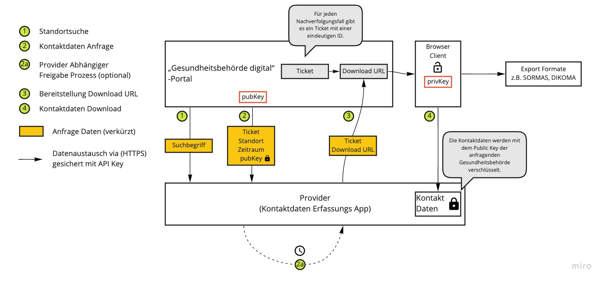

# Implementierungsleitfaden

> # Work in Progress 
> Definitionen sind noch in Bewegung. Wenn ihr jetzt implementiert, müst ihr möglicherweise in naher Zukunft Dinge ändern. 
  

Implementierungsleitfaden zur sicheren Übertragung von Kontaktnachverfolgungsdaten externer Dienstleister in die Infrastruktur der Darfichrein GmbH. 

## Glossar

| Begriff                             | Erklärung                                                                                                                                                                   |
|-------------------------------------|-----------------------------------------------------------------------------------------------------------------------------------------------------------------------------|
| „Gesundheitsbehörde digital“-Portal | Die zentrale Plattform für den sicheren Austausch zwischen  Providern  und Gesundheitsbehörden.   Bereitstellung erfolgt im Rahmen der Initiative “Wir für Digitalisierung” |
| Provider                            | Kontaktdaten Erfassungs App  z.B. Darf Ich Rein, Recover, E-Guest, Luca                                                                                                     |
| Destination                         | Ort an dem Kontaktdaten erhoben werden.   z.B. Restaurants, Supermarkt, Friseure                                                                                            |
| Kontaktdaten                        | Personenbezogene Daten einer Person die sich in einer Destination zu einem bestimmten Zeitpunkt aufgehalten hat.                                                            |
| Exportformate                       | z.B. SORMAS, Dikoma, Mikado                                                                                                                                                 |
 
# Ablauf

## Onboarding Gesundheitsbehörden

Die Darfichrein GmbH sorgt für das Onboarding der deutschen Gesundheitsbehörden. Jede Behörde bekommt ein eigens für Sie innerhalb des Browsers generiertes Schlüsselpaar (RSA, 4096 Bit). Der öffentliche Schlüssel wird innerhalb der Telemetrie der Darfichrein GmbH persistiert.

## Kontaktdaten bei Providern anfordern (Gesundheitsbehörde)

Für die Behörde ist der Provider transparent. Über eine Volltextsuche werden alle angeschlossenen Systeme angefragt und durch Standortinformationen (Anschrift) kann der Mitarbeiter die entsprechende Destination wählen.

## Daten liefern (Provider)

Ziel ist jetzt, der anfragenden Gesundheitsbehörde die Kontaktdaten zur Verfügung zu stellen - falls diese durch Public Key-Infrastruktur verschlüsselt sind. Andernfalls können die geforderten Daten direkt mit dem öffentlichen Schlüssel der Behörde verschlüsselt und an einen definierten HTTP-Endpunkt der Darfichrein GmbH übertragen werden.

## Daten exportieren und verarbeiten (Gesundheitsbehörde)

Die Behörde als solche kann die Datensätze nun mit dem privaten Schlüssel entschlüsseln, exportieren und ins jeweilige System der Gesundheitsbehörde importieren. Exportformate können jederzeit erweitert werden.

# Definition Daten und Schnittstellen

## Grundsätzliches

Da diese Anfrage nur innerhalb der Anwendung der Gesundheitsbehörden stattfindet, werden keine Request bekannt werden.
Wir bitten dennoch, einen HTTP-Header (z. B. x-wfd-api-key) für einen API-Key für alle HTTP-Anfragen zu implementieren. Der API-Key wird vom Portal generiert, den Providern zur Verfügung gestellt und sollte nur Zugriff auf die nachfolgenden Ressourcen gewähren.


Die Spezifikation liegt im OpenAPI-Format unter https://github.com/wirfuerdigitalisierung/documentation/blob/main/specs.yaml vor. 

Für eine bessere Darstellung könnt ihr die spec in https://editor.swagger.io/ importieren. 

## Schaubild

Das folgenden Schaubild ist eine High-Level Darstellung des Zusammenspiels von „Gesundheitsbehörde digital“-Portal und Providern. 



Die einzelnen Prozessabschnitte sind folgend Definiert. Die dazugehörige Stelle in der API Dokumentation ist entsprechend als Fußnote verlinkt. 

## Ressource: Standortsuche

Die Standortsuche ist von allen beteiligten Providern selbst zu implementieren und bereit zu stellen.
Wir plädieren für einen HTTP/GET-Request.

### Use-Case

Als Mitarbeiter des Gesundheitsamtes möchte bei Eingabe von mindestens 4 Zeichen eine Suche nach Standorten auslösen. Als Ergebnis erwarte ich, dass ich alle an Provider angeschlossene Destinationen erhalte, die mit meinem Suchbegriff starten - unabhängig der Majuskeln bzw. Minuskeln (case-insensitive).

### Definition der HTTP-Response

Die Definition der erwarteten Response ist dem [OpenAPI-Dokument im Repository zu entnehmen](https://github.com/wirfuerdigitalisierung/documentation/blob/0815402ae2189cad167be7b7e129ec49c389032a/specs.yaml#L27).

## Ressource: Kontaktdaten Anfrage

Die Kontaktdaten Anfrage wird seitens „Gesundheitsbehörde digital“-Portal ausgelöst. Im Zuge dessen ist es wünschenswert, dass jeder Provider eine HTTP/POST-Anfrage zulässt, um die Anfrage innerhalb seines Systems aufzunehmen und zu verarbeiten.

### Use-Case

Als Mitarbeiter des Gesundheitsamtes möchte ich eine Anfrage zur Kontaktdaten Anforderung an den vorher festgelegten Standort senden können. Dieser muss die Informationen wie Zeitraum und ggf. Kontext der Kontaktdaten Anfrage annehmen und entsprechend verarbeiten. Dabei ist es elementar, die Daten entsprechend des Zeitraums einzuschränken. Als Sicherheitskriterium möchte ich, dass das Zertifikat meines Gesundheitsamtes mitgesendet wird, um die Anfrage zu verifizieren.
### Definition des HTTP-Requests

Die Definition des Request ist dem [OpenAPI-Dokument im Repository zu entnehmen](https://github.com/wirfuerdigitalisierung/documentation/blob/0815402ae2189cad167be7b7e129ec49c389032a/specs.yaml#L66).

## Ressourcen: Kontaktdaten Download

Herzstück von Gesundheitsbehörde digital ist die Entgegennahme von Ende-zu-Ende-verschlüsselten Kontaktdaten Informationen unterschiedlicher Provider. Dabei werden im Portal selbst keine Daten gespeichert. Die verschlüsselten Kontaktdaten werden von den Providern zum Download bereitgestellt und innerhalb des Browsers im Portal entschlüsselt. 

### Use-Case

Als Mitarbeiter des Gesundheitsamtes möchte ich, dass angefragte Kontaktdaten mit dem öffentlichen Schlüssel meiner Behörde verschlüsselt sind und einem Fall zugeordnet bereitgestellt werden.
Dabei ist mir wichtig, dass alle Provider die Struktur der persönlichen Daten homogen halten, um eine automatische Einordnung in bestimmte Formate (z. B. CSV-Export) zu erlauben.

### Definition der HTTP-Requests

Die Definition der Bereitstellung der Download URL ist dem [OpenAPI-Dokument im Repository zu entnehmen](https://github.com/wirfuerdigitalisierung/documentation/blob/0815402ae2189cad167be7b7e129ec49c389032a/specs.yaml#L98).

Die Definition des Download Requests  ist dem [OpenAPI-Dokument im Repository zu entnehmen](https://github.com/wirfuerdigitalisierung/documentation/blob/0815402ae2189cad167be7b7e129ec49c389032a/specs.yaml#L130).

## Format: Kontaktdaten

Damit alle Provider schnell integriert werden können, ist es wichtig, sich auf eine einheitliche Struktur der Daten zu einigen.
Die Struktur selbst in den Spezifikationen definiert.
Die Schlüssel sind bewusst auf ein Zeichen reduziert, um mehr Platz für Daten zu lassen.

CAVE

Mit 4096 Bit im RSA-Verfahren lassen sich nur knapp 450 Byte verschlüsseln.

## Verschlüsselung

Das Portal selbst nutzt für die Verschlüsselung der Kontaktdaten einen 4096 Bit-Schlüssel. Das angewandte Verfahren ist RSA. Die genutzte Bibliothek innerhalb des Portals ist node-forge.
Der öffentliche Schlüssel des Gesundheitsamtes wird base64-codiert übertragen. Nach dem Dekodieren liegt der Schlüssel im sogenannten Private Enhanced Mail-Format (PEM) vor.

### Schematischer Ablauf

```
userData entspricht bereits dem Objekt ContactData und beinhaltet alle relevanten Informationen.
const pubKeyEnc = base64Decode(givenPublicKey);
const pubKeyEncryption = publicKeyFromPem(pubKeyEnc);
const encrypted = pubKeyEncryption.encrypt(userData);
const dataToTransport = base64Encode(encrypted);
```

## Integration in Gesundheitsbehörde digital

Die Darfichrein GmbH übernimmt die Implementierung der notwendigen Schnittstellen an alle Provider. Als Maßgabe sind maximal 48 h veranschlagt, um gemeinsam und zügig voranschreiten.
Die Darfichrein GmbH stellt allen Providern einen Zugang zum Testsystem zur Verfügung, um auch die eigene Integration zu testen, verifizieren und validieren.


## Fragen

Bei Rückfragen bitte direkt Kontakt richten an:
Stefan Michalk, stefan@darfichrein.de, 0151 4423 7061 (am liebsten via WhatsApp)
